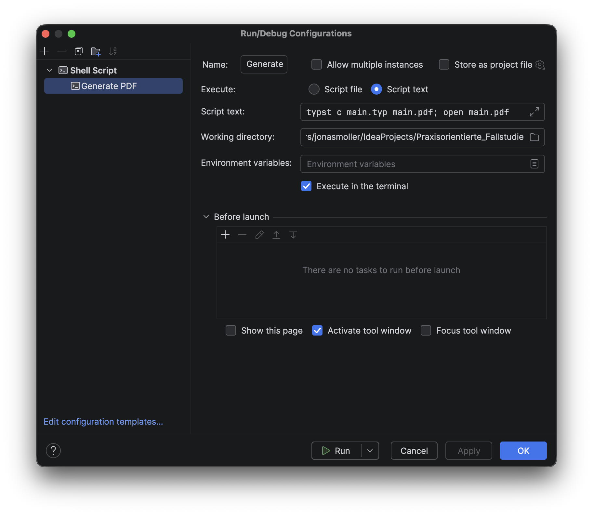

# Hochschule Fulda Typst Package

## Installation von Typst
### MacOS
```zsh 
brew install typst
```

### Linux
```bash
sudo snap install typst
```

### Windows
```bash
winget install --id Typst.Typst
```

## Installation des Package
Für die Nutzung des Packages muss es in dem ```package``` ordner für Typst liegen. Diesen findet man mit: 
```zsh 
typst info
```
Standard mäßig sollte dieser hier zu finden sein: 
- MacOS: **~/Library/Application Support/typst/packages**
- Linux: **$XDG_CACHE_HOME** oder **~/.cache**
- Windows: **%LOCALAPPDATA%**

Falls der Ordner noch nicht existiert, muss er erstellt werden.

## Nutzung 
Zu erstellung eines Templates steht dann folgender Befehl zur Verfügung: 
```zsh 
typst init @local/HSFD-Template
```

## PDF generieren
```zsh 
typst c main.typ main.pdf
```

### intellij Konfiguration
